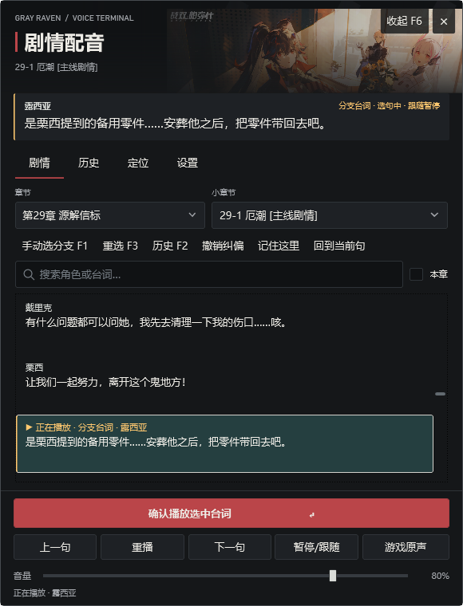
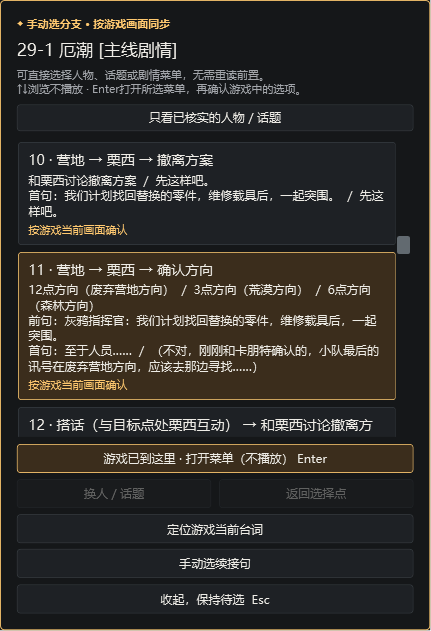
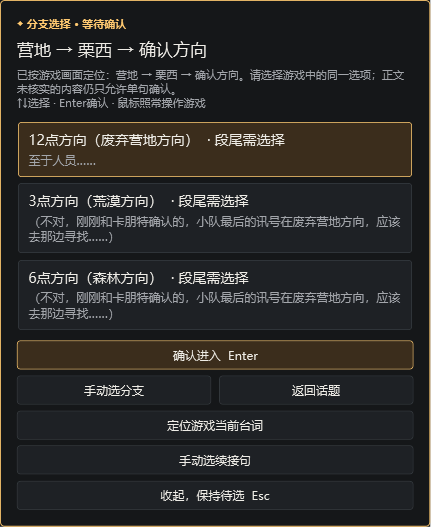
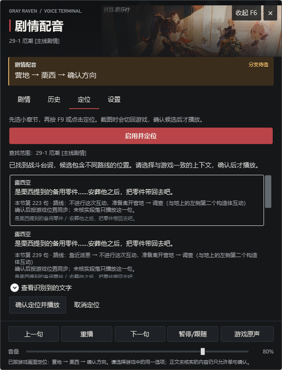

# 剧情配音播放器：配置要求与使用指南

这份说明适用于第3—42章网络发布包。玩家下载所需章节后，可以逐句播放配音、手动选择游戏中的分支；OCR 是可选的截图定位功能。

## 需要什么配置

| 项目 | 要求与说明 |
|---|---|
| 系统 | Windows 10 或 Windows 11 的 **x64（64 位）** 版本。此次发布没有 x86 或 ARM 版。 |
| 处理器与显卡 | Windows x64 电脑；OCR 使用 CPU，最多两个推理线程，**不要求独立显卡或 CUDA**。游戏自身仍须满足游戏的配置要求。 |
| 内存 | 建议在游戏运行所需内存之外，为 OCR **预留约 1 GB 可用内存**。本机 852×480 测试图的 OCR 进程峰值约 271 MB；其他分辨率和画面可能不同，271 MB 不是最低配置。 |
| 磁盘 | 播放器解压约 79 MB，可选 OCR 解压约 287 MB；章节配音包另占空间，按需下载。解压时还要同时放得下 ZIP 和解压后的文件。 |
| 声音 | 使用 Windows 正常工作的扬声器或耳机；可以在播放器设置中选择输出设备。 |
| 游戏画面 | 建议窗口或无边框窗口模式，并让需要定位的文字完整显示。游戏最小化时无法正常截图。 |
| 网络与开发环境 | 下载完所需 ZIP 后可离线使用；无需安装 Python、.NET SDK/.NET 运行时，也无需下载或配置 OCR 模型。 |

以上内存数据来自一台 Windows 11 x64 电脑上的指定测试图，不能代表所有玩家电脑。当前发布包已在新解压目录通过启动和离线 OCR 测试；**尚未在另一台全新 Windows 电脑上实测**。

## 下载和解压

1. 下载 `01-播放器-Windows-x64.zip`。这是必需文件。
2. 在“章节配音包”目录下载自己要玩的章节 ZIP；至少选择一章。40章不必一次下载完。
3. 想用 F9 截图定位时，再下载 `02-OCR组件-可选.zip`。只用手动播放和 F1 分支菜单时无需 OCR 包。
4. 将选中的 ZIP **解压到同一个位置**，合并同名的“战双剧情配音播放器”文件夹。不要在压缩包预览窗口内运行程序，也不要让文件夹多套一层。

解压完成后结构应当类似：

```text
战双剧情配音播放器/
  PgrVoice.exe
  配置要求与使用指南.md
  Assets/
  配音包/
    第29章_源解信标/
      pack.json
      audio/
  ocr/                         ← 下载可选 OCR 包时才有
    PgrOcr.exe
    models/
    _internal/
```

播放器 ZIP 约 70 MiB，可选 OCR ZIP 约 140 MiB。章节 ZIP 大小见发布目录的《发布检查报告》；解压后大小会增加。先确认磁盘剩余空间足够容纳 ZIP 与解压文件两份。

## 第一次打开与逐句播放

1. 双击 `PgrVoice.exe`。程序会自动查找旁边的“配音包”目录；配音包放在其他位置时，从设置中选择其总目录。
2. 在设置中刷新并绑定正在运行的战双游戏窗口。选择要玩的章节和小章节，再选起始台词。
3. 检查“游戏同步下一句”按键是否和游戏推进键一致；默认是空格，可在设置里改键并测试。
4. 回到游戏操作。按一次推进键，软件才进入下一句；下一句会停止上一句录音，播完后等待玩家。浏览、滚动、悬停、切章节和重启恢复都不会自行播放。
5. 想单独纠正配音位置，可用 PageUp/PageDown 调整，再用 F5 重播；F7 暂停或恢复跟随。



## 游戏出现选择项：F1 手动选分支

游戏里用鼠标照常选择，按 **F1**（或点“手动选分支”）打开配音菜单。用 ↑↓ 找到和游戏画面相同的人物、话题或路线，按 Enter 打开；再确认具体选项。查看和打开菜单都保持静音，确认进入台词才播放。面板展开时，游戏在前台也可以按 F1。

软件的前置进度可能落后于游戏。只要游戏中确实显示这个选项，就能在配音菜单中手动定位；这样不会把软件里的任务条件伪造成已完成。选错按 **F3** 回到最近一次选择点，也可以再次按 F1 换人或话题。未核实的段落仍只允许单句确认；遇到未知出口时会停下并提示续接。





## 游戏文字和配音对不上：F9 定位

先确认 OCR ZIP 已完整解压，设置里的“OCR 辅助定位”已启用，并选对当前小章节。让游戏窗口显示完整台词或选项后按 **F9**。软件只在此时截图、识别，列出最多三个候选；浏览候选不会播放。

- 选中和游戏画面对应的句子，点击“确认定位并播放”或按 Enter，才从该句继续。
- 识别到的是选择菜单时，确认只打开菜单；还要选中游戏中的同一选项。
- 相同台词可能出现在多条路线，查看候选的“路线、前后句”再确认。OCR 不会擅自跨章节或替你选分支。
- 如果正在游戏原声时段，先按 F8 进入续接选择，再明确确认要恢复的台词。



## 常见问题

**双击后没看到播放器：**确认已经完整解压，查看任务栏或屏幕边缘的小悬浮球。重新双击会唤出已打开的播放器。仍无法启动时，在 `%LOCALAPPDATA%\PgrStoryVoice` 查看 `player.log`。

**按 F9 没反应：**确认游戏窗口已绑定、游戏没有最小化、当前小章节正确；检查 OCR 文件夹内是否有 `PgrOcr.exe`、`models` 和 `_internal`，并在设置里启用 OCR。若 F9 已被其他动作占用，可修改按键。手动播放和 F1 分支不依赖 OCR。

**识别出了文字却找不到台词：**先等游戏把整句显示完整，再检查小章节和候选路线。可展开“查看识别到的文字”检查截图结果，或改用 F1、正文搜索及手动续接。

**游戏里能选的分支，在软件中提示前置未完成：**按 F1 打开本节的完整分支目录，按游戏当前画面定位并确认相同选项；不用重读前面的剧情。

**OCR 报缺少 `VCRUNTIME`、`MSVCP` 等 DLL：**某些 Windows 电脑可能需要 Microsoft Visual C++ x64 运行库。只在遇到这类报错时，按[微软官方说明](https://learn.microsoft.com/en-us/cpp/windows/latest-supported-vc-redist)安装最新受支持的 x64 版本，再重新打开播放器。不要从非官方站点下载单个 DLL。

**分享或更新时：**分别上传播放器、可选 OCR 和章节 ZIP，并附上发布目录的下载说明与 `文件校验.json`。升级程序前关闭播放器；用户按键、音量和进度保存在自己的 Windows 用户目录，不在分享包里。
